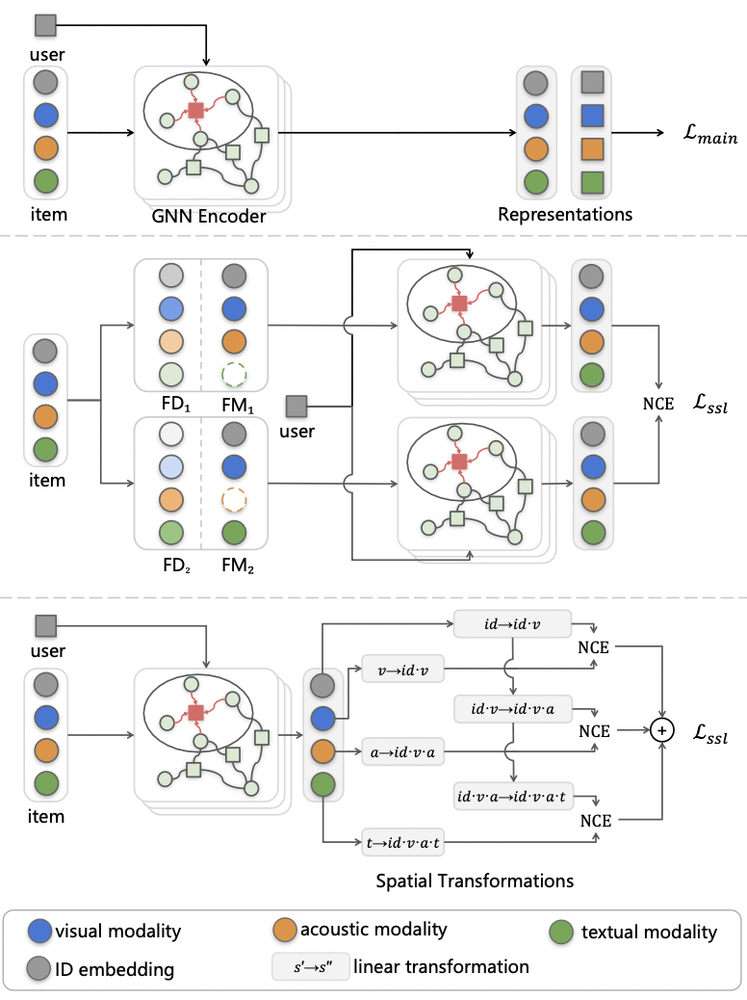

# SLMRec

"Self-supervised Learning for Multimedia" (SLMRec) aims capture multi-modal patterns in the data itself, we go beyond the supervised learning paradigm, and incorporate the idea of self-supervised learning (SSL) into multimedia recommendation.

> Authors: Zhulin Tao, Xiaohao Liu, Yewei Xia, Xiang Wang, Lifang Yang, Xianglin Huang, Tat-Seng Chua

<p align="center">

</p>

## Installation
The code has been tested running under Python 3.6.5. The required packages are as follows:
* torch==1.7.0
* numpy==1.16.1
* torch_geometric==1.6.1

## Data download
We provide three processed datasets: Kwai, Tiktok, and Movielnes.  
- You can find the full version of recommendation datasets via [Kwai](https://www.kuaishou.com/activity/uimc), [Tiktok](http://ai-lab-challenge.bytedance.com/tce/vc/), and [Movielens](https://grouplens.org/datasets/movielens/).
Since the copyright of datasets, we cannot release them directly. 

## Run SLMRec
The hyper-parameters used to train the models are set as default in the `conf/SLMRec.properties`. Feel free to change them if needed.

```sh
python3 main.py --recommender="SLMRec" --data.input.dataset=tiktok
```

## citation

```
@ARTICLE{SLMRec,  
  author={Tao, Zhulin and 
          Liu, Xiaohao and 
          Xia, Yewei and 
          Wang, Xiang and 
          Yang, Lifang and 
          Huang, Xianglin and 
          Chua, Tat-Seng},  
  journal={IEEE Transactions on Multimedia},   
  title={Self-supervised Learning for Multimedia Recommendation},   
  year={2022},  
  doi={10.1109/TMM.2022.3187556}
}
```

Copyright (C) Communication University of China

This program is licensed under the GNU General Public License 3.0 (https://www.gnu.org/licenses/gpl-3.0.html). Any derivative work obtained under this license must be licensed under the GNU General Public License as published by the Free Software Foundation, either Version 3 of the License, or (at your option) any later version, if this derivative work is distributed to a third party.

The copyright for the program is owned by Communication University of China. For commercial projects that require the ability to distribute the code of this program as part of a program that cannot be distributed under the GNU General Public License, please contact taozhulin@gmail.com to purchase a commercial license.

